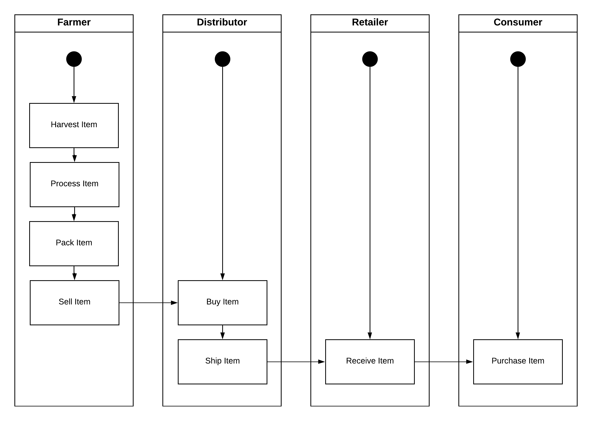
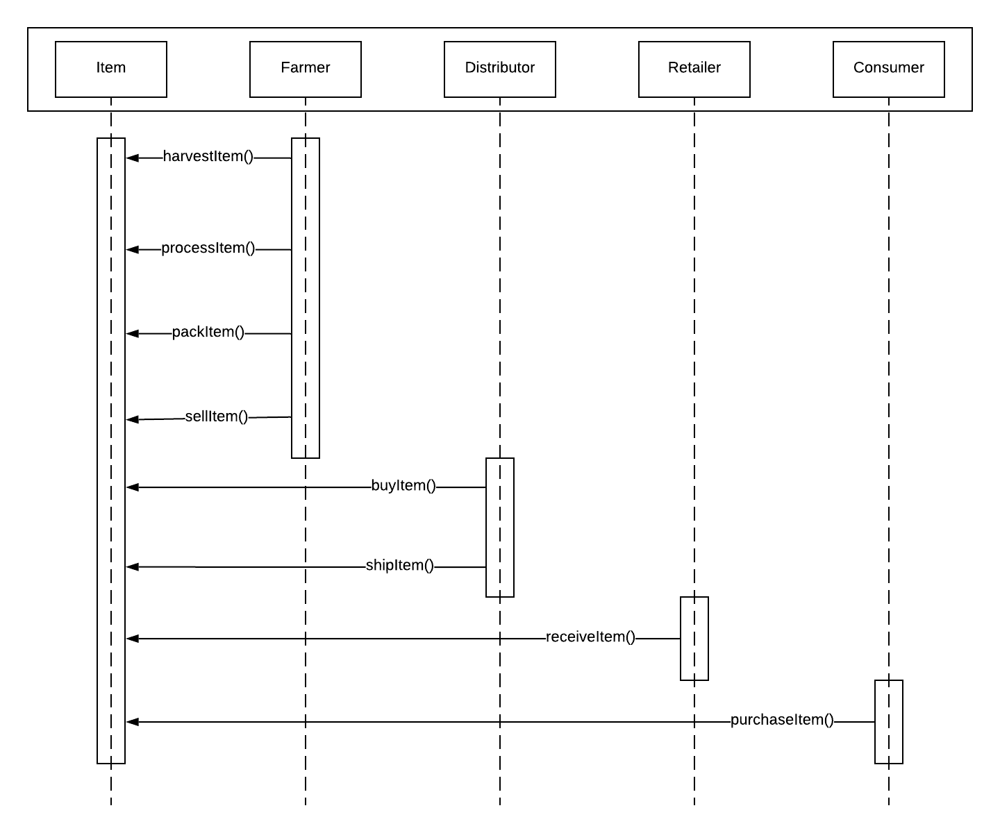
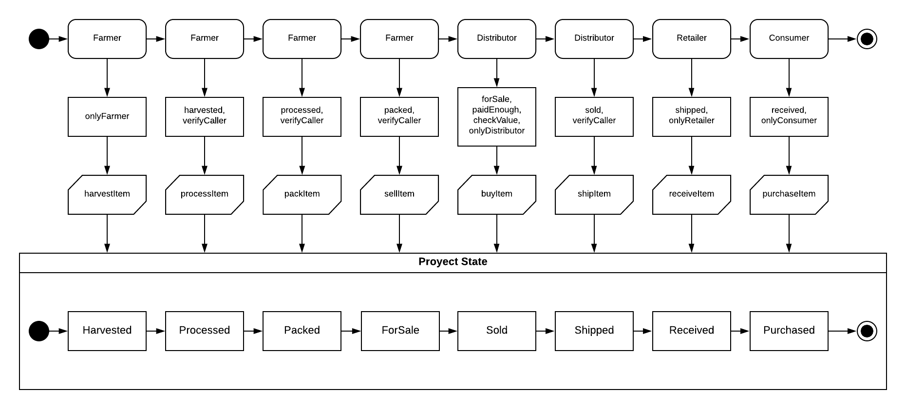
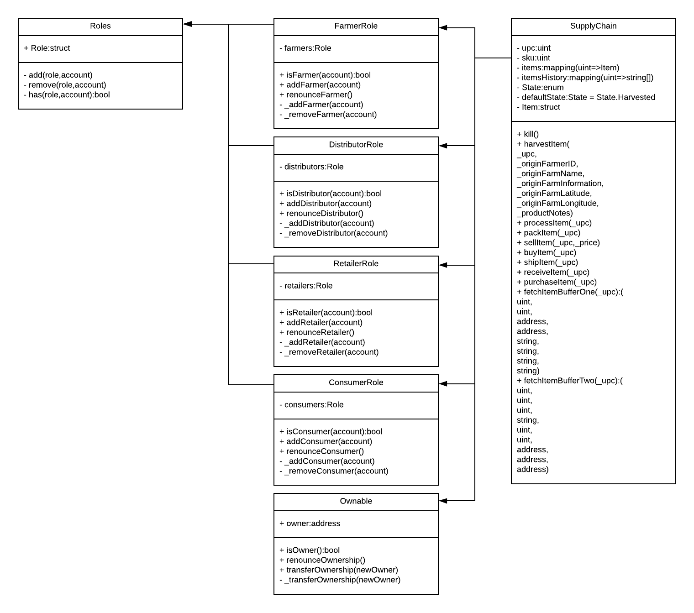

# Ethereum-Dapp-for-Tracking-Items-through-Supply-Chain

This is a DApp supply chain solution backed by the Ethereum platform.
It tracks an items state through its life cycle from the farmer to the consumer.
It considers four different actors that interact in this supply chain: Farmer, Distributor, Retailer and Consumer.
Each actor has his own user permission controls and different actions associated to his role:

- Farmer can harvest, process, pack and sell the item.
- Distributor can buy and ship the item.
- Retailer can receive the item.
- Consumer can purchase the item.

Each time a valid action is performed the items state is changed (Harvested, Processed, Packed, ForSale, Sold, Shipped, Received, Purchased).

The item's complete info and the addresses of the actors that have interacted with it can be tracked and it's authenticity verified at any point through this supply chain. 

# Activity diagram

# Sequence diagram

# State diagram

# Class diagram

# Contract on Rinkeby network
Transaction hash: 0xb2517c25ca3c32d806b0e26f149d394bd77125467b5d7ee176307a36fcc1a1df

Contract address: 0x69E59e8cF8465fd1Fe198c6a88803374b4d34f9E

# Libraries
  - Based on the Udacity project code: https://github.com/udacity/nd1309-Project-6b-Example-Template
  - Truffle v4.1.14 (core: 4.1.14)
  - Solidity v0.4.24 (solc-js)
  - Node v10.15.3
  - Web3.js 1.0.0-beta.55
  - truffle-hdwallet-provider 1.0.14
